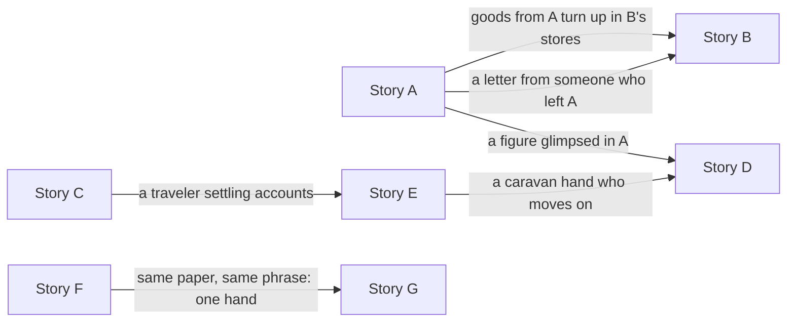

# Collection

## Status

**Writing reference: a general guideline for making a set of Sunday Morning stories work as a collection, in any setting.** This page owns the method for a collection *as a set*: the one-sentence pitch, reading order and calendar, what the reader knows after each story, the cross-story promises, and (if the collection belongs to a saga) how the set sits on the larger web. It gives a fill-in template for each part. It adds no facts about any world.

Each collection gets its own copy of this page in its own folder (see [Starting a new collection](README.md#starting-a-new-collection)). In that copy, each story page still owns its own story and its own Larger-world thread; the collection page only shows how they connect. The calendar and every attribution in a collection's copy are **provisional** until the setting's owner pages settle them. The saga's open questions (such as the antagonist's identity and plan) stay open there, and the setting's owner pages outrank the collection page on setting facts. The rules for the tie to a larger story are on [Rules](Rules.md#connecting-to-a-larger-story).

A collection's copy records its development level at collection level (see [Development levels](Pipeline.md#development-levels-what-done-means)). The THINK and PLAN pass at the end of this page takes a collection to **L2 Outlined**; each story then moves through its own levels on its own page.

## The collection in one sentence

Write the whole collection as one sentence before anything else. It names the set of communities, the span of time, the pressure they share (if any), and what the reader gets that the characters don't.

The first collection's sentence had this shape: several small communities, one bad year; a nail lands in each (a **nail** is the smallest unit of pressure from the larger web that lands in one community; see [Rules](Rules.md#connecting-to-a-larger-story)), and each holds for its own small reasons, while the reader alone watches the pattern gather.

Template:

```text
<Number> small communities, <span of time>: <the shared pressure, if any> lands in each,
and each <holds / bends / answers> for its own small reasons, while <what the reader alone sees>.

Working title, provisional: <title>
```

A collection that doesn't belong to a saga still gets a sentence; the shared pressure can be a season, a festival cycle, a road or a trade instead of a web.

## Reading order

Read in calendar order. Each story stands alone; read in order, they add up to the span of time the collection covers. If the collection belongs to a saga, the order follows the larger ripple chain: for example, a crop fails in the autumn of year 1, its effects reach the workshops and mountain passes the next spring, and displaced families reach a city by the following autumn.

The **Clock** column is the calendar marker each story happens around: a festival, a market day, a season opening, an accounts day. Festivals make good clocks (see [Rules](Rules.md#setting-palette)).

The last column is the **expected reader state**: PLAN's expected-evidence idea applied to the reader. It says what the reader should know, suspect or feel after each story, read in order. JUDGE checks drafts against it.

Template:

| # | Story | When | Clock | What the reader gains |
| --- | --- | --- | --- | --- |
| 1 | | | | |
| 2 | | | | |
| 3 | | | | |
| … | | | | |

How the column moved in the first collection:

- The first story read as purely local. A rumor died and a polite land agent left; nothing pointed outward.
- Middle stories each added one small thing a reader could carry forward: a second rumor on another coast dying the same way, a sack of grain from the first story turning up in the second, credit tightening somewhere far away, a minor figure glimpsed in one story who matters in the next.
- A later story repeated a pattern with one matching detail (the same paper, the same turn of phrase), so the attentive reader could connect two events that nobody in either story connects.
- The last story left the reader knowing more than anyone in it.

## How the stories connect

Every connection rides a real flow in the world: goods, credit, travel, letters, displaced people. Never coincidence. If no trade or travel route explains why a person, object or piece of news is in a second story, the link goes.

Each story links to at most two others, so none depends on another to be understood. A story may carry more than two details outward, as long as they reach no more than two other stories. (In the first collection, the opening story carried three details, but they reached only two stories.)

Example with placeholder names:



A collection's copy draws its own diagram from its ledger below.

### Cross-story promise ledger

Every line is a promise the reader can check. The links are provisional: a draft that doesn't want one can drop it back to nothing, unless that link has been made a ruling (record it in [Per-collection decisions](Decisions.md#per-collection-decisions)). While a link stands, the setup end is authoritative, and the other end must match it.

| Promise | Set up in (authoritative) | Pays off in | Flow it rides | Must match | Recognition needed? |
| --- | --- | --- | --- | --- | --- |
| | | | | | |

Illustrative rows (anonymized from the first collection):

| Promise | Set up in (authoritative) | Pays off in | Flow it rides | Must match | Recognition needed? |
| --- | --- | --- | --- | --- | --- |
| A stamp on grain sacks naming the two groups who handed the grain out | Story A, the scene where the grain is handed out | Story B, the winter stores | Story B's region imports grain in winter | the stamp wording, in both orders | No: a pleasant detail for those who notice |
| A watermark and a turn of phrase on two unsigned letters making offers | Story F, the scene where the first letter arrives | Story G, the scene where the second buyer writes | Offers by letter are ordinary; both come through the same city stationer | unsigned, the paper, the watermark, the exact phrase | Yes, for the collection's payoff: the watermark and phrase must be salient where they first appear |

"Recognition needed?" takes three answers: **No** (a pleasant detail for those who notice), **Optional** (the line works without it) and **Yes** (the collection's payoff depends on the reader connecting the two ends). In the first collection there was exactly one Yes link, and it was the collection's only link to the hidden hand. No character connected the two letters; only the reader who had read both could.

**Salience.** Readers keep gist, not wording. A detail that must be recognized gets salience where it first appears (for example, a character reads the phrase aloud to someone), and one concrete sentence at each end (the watermark described plainly in both stories).

**Saga links are not cross-story links.** If a story also advances the saga (for example, the saga's protagonist meets a pattern for the first time that the saga's middle arc will turn on), record that on the story page's Larger-world thread, not in this ledger.

## The web

*Applies only if the collection belongs to a larger setting or saga. Stories that stand alone skip this section and go to [Collection-level THINK and PLAN](#collection-level-think-and-plan).*

Each story lands on a different link of the ripple chain that the setting's own notes on current events describe: for example, one trade route gets riskier, credit tightens, a staple stops selling, farms fail, orders fall in the next trade, and so on outward.

If the setting keeps a map of the larger web, place every story (and every seed not yet written) on it and mark the open nails. The map is a derived view: the setting's owner pages outrank it.

### The threads

A summary of each story page's Larger-world thread; the story page owns the detail. "Behind it" is an out-of-story, provisional attribution that nobody inside a story knows. It can be the saga's antagonist, a hidden power, ordinary life, or `UNKNOWN`.

Template:

| Story | Current event | Saga figure | The nail | Behind it | Local outcome | Outward effect |
| --- | --- | --- | --- | --- | --- | --- |
| | | | | | | |

Notes on filling it in:

- **Saga figure** is the saga's figure whose thread the story touches, if any. "None" is a fine answer; in the first collection two of seven stories had none.
- **Behind it** is not always the antagonist. In the first collection the answers ranged across "rumor amplified by the antagonist", "`UNKNOWN`: connected finance or ordinary speculators", "ordinary pressure from lenders, not a scheme" and "ordinary prejudice". Keeping that distinction is what makes the web believable.
- **Local outcome** is what locals do for local reasons.
- **Outward effect** is the second- and third-order effect beyond the story, including how the antagonist or a hidden power could read or use it. A good outcome can set a precedent a rival could later read as something else (in the first collection, two neighboring groups trading directly could later look like a bloc forming).

### Where the nail still fell

Every story holds its own ground, but the same nail succeeds somewhere just offstage. Local holds; the system still moves. A web where every nail misses would be too tidy, and the antagonist's plan too weak to matter. Each of these appears in its story as one line at most, never as the story's subject ([tone guardrails](Rules.md#tone-guardrails)), ideally carried by an object or a passing remark.

Template:

| Story | Holds here | Still falls elsewhere |
| --- | --- | --- |
| | | |

Illustrative rows (anonymized):

| Story | Holds here | Still falls elsewhere |
| --- | --- | --- |
| Story A | No farm here sells to the land agent | Farms elsewhere do; a family in a later story is one of them |
| Story C | The town closes its accounts without ruin | In other towns forced closures ruin families; a tea seller has heard of two |
| Story F | The craftsman never answers the letter | Someone the saga already knows answered his |

In the first collection, one "still falls elsewhere" line also served as a cross-story link: a family in a later story turned out to be one who didn't escape.

### The view from the desks

Out of story: what each hidden power could conclude from each story's events, tracing their second- and third-order effects. Written for the saga's use, and provisional for as long as the antagonist's plan is open in the setting's owner pages.

Template (one column per hidden power):

| Story | The antagonist's desk sees | <Hidden power>'s desk sees |
| --- | --- | --- |
| | | |

Typical entries run from "Nothing" through "Noise" and "Noise, unless it repeats" to "Worth watching". Look for misreadings: in the first collection one power read ordinary pledges changing hands as speculators and might pay more to clear them, a misreading the antagonist could use; another might squeeze a group whose cooperation it distrusted, and the antagonist could then point to that squeeze as proof.

Individually, every entry is noise. Together they may form the kind of pattern the saga's antagonist eventually notices: in the first collection, people repairing connections without being paid or coerced. That realization belongs to the saga, not to any Sunday Morning story.

### What the web adds

Taken together, the stories are places where a nail should have landed and, mostly, didn't, because people acted for small local reasons. That is the collection's claim about ordinary decency: it changes relationships; it doesn't undo the web. Show the other side too. In the first collection, two stories did: one community's good outcome may feed a later suspicion, and one town's honesty kept it open but was only one pass among many.

## Collection-level THINK and PLAN

Run THINK and PLAN once for the collection as a whole. In the first collection this pass ran after every story had reached L2. See the [Pipeline](Pipeline.md#collection-shape-check-for-a-set-of-stories) for where this sits. A collection's copy records the results here under a Development record.

### THINK at collection level

**Reasoning allocation:** structured single path plus reserve methods. THINK's tests don't earn extra methods by default. Reserve methods come in only when each is tied to a specific failure signal found in the collection; that is THINK's rule for bringing them in (see [Stage 1](Pipeline.md#stage-1--think-harden-the-concept)). In the first collection they were used at the author's request, each tied to a signal.

| Method | Failure signal it answers | Finding (generalized from the first collection) |
| --- | --- | --- |
| **Frame challenge** | Are these separate stories, or one work? | A linked cycle, read in calendar order, each story standalone. The collection's arc is the reader's growing knowledge, not any character's. |
| **Systems thinking** | The stories touch the larger chain but not each other: spokes, no rim. | Links must follow real flows (goods, credit, travel, letters, displaced people). Test every link against that; see the [ledger](#cross-story-promise-ledger). |
| **Inversion / premortem** (saga only) | Every nail fails. The web is too tidy, and the antagonist would never be that unlucky. | Local holds, the system still moves. In every story the same nail succeeds just offstage; see [Where the nail still fell](#where-the-nail-still-fell). |
| **Perspective shift** (saga only) | Nobody has looked at these events from the antagonist's or the hidden powers' side. | Record it as [the view from the desks](#the-view-from-the-desks). Individually each story is noise; together they are the kind of noise the antagonist might eventually notice, if the saga's arc allows it. |
| **Abduction** | What should an attentive reader be able to infer, and when? | Pick the story where the connected explanation ("someone is behind these") becomes the best one available. In the first collection that was the second-to-last story. Nothing in the stories confirms it. Put it in the [reading order](#reading-order)'s reader-state column. |
| **Counterexample search** | Do the links become coincidence? | Reject any appearance no flow explains: the saga's protagonist turning up in a second story with nothing to put them there, a minor figure appearing in person in a city they'd have no reason to visit. Keep only links a trade or travel route explains. |

**PLAN handoff** (template; the alternatives are the ones the first collection weighed, and they apply to most collections):

```text
frame             a linked cycle: <N> communities, <span of time>, <one larger web the characters never see | a shared season or trade>
selected strategy calendar reading order; each story linked to ≤2 others, each link on a real flow; local holds, system moves
alternatives      A a shared protagonist across stories: set aside, breaks "the world exists without the protagonist"
                    (and, in a saga, the protagonist's own arc)
                  B no links at all: set aside, the collection would not add up to <the span of time>
                  C every link explicit: set aside, stories would stop standing alone
assumptions       <calendar and all attributions provisional>
decided           <each ruling, who made it and when; e.g. which links are fixed rather than droppable>
reconsider if     any story needs another to be understood; a link feels like coincidence in draft;
                  the reader's inference arrives before story <N> or never
```

Rulings in the "decided" line go in [Per-collection decisions](Decisions.md#per-collection-decisions). The protagonist rule behind alternative A is on [Rules](Rules.md#the-sagas-main-characters).

### PLAN at collection level

**Decomposition:** one drafting task per story. No finer breakdown is needed: cross-links are cameos and details, not plot dependencies. Any story can be drafted independently; the ledger's authoritative end settles any mismatch.

**Reconsideration triggers**

- A draft needs another story's events to make sense → cut the link back to a detail (PLAN).
- Readers of the first story alone sense a conspiracy → the pressure reads too pointed; soften it (THINK on that story).
- The collection reads as a row of identical "the town holds" endings → vary the endings' cost (THINK). The [Registry's story shapes](Registry.md#story-shapes) track this.
